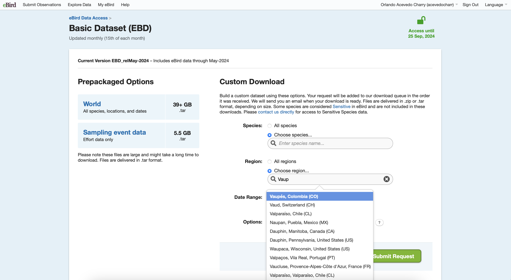
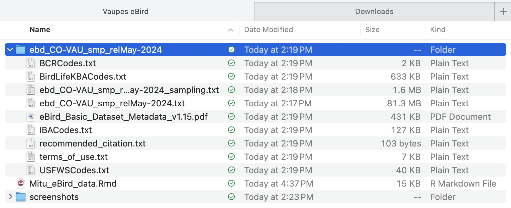

This code presents the analysis of eBird data from Mitú, Vaupés, in the easternmost Amazon region of Colombia. The aim is to use eBird data to evaluate community science contribution in a remote region of northwestern Amazonia.

Este código presenta el análisis de los datos de eBird de Mitú, Vaupés, en el borde oriental de la Amazonia colombiana. El objetivo es usar datos de eBird para evaluar la contribución de ciencia comunitaria en una región remota de la Amazonia noroccidental.

# Packages needed - Paquetes necesarios

You will need to have some packages installed to access the data and manipulate it.

Necesitara tener algunos paquetes instalados para accesar los datos y manipularlos.

```{r}
#eBird data filters - filtro a los datos de eBird
library(auk); 
#seven packages in one for data management and visualization - siete paquetes en uno para manipulación y visualización de datos
library(tidyverse);
#Spatiotemporal Subsampling - submuestreo espaciotemporal
library(dggridR); 
#load maps - cargar mapas
library(maps); 
#composite figure - figuras compuestas
library(gridExtra); 
#Sankey plot with ggplot
library(ggsankey) #should be installed via `devtools::install_github("davidsjoberg/ggsankey")`

```

# eBird data download - descarga de datos de eBird

We download the eBird data in [eBird - Data Access](https://ebird.org/data/download) - you should be logged in.

Descargamos los datos de eBird en [eBird - Acceso a los datos](https://ebird.org/data/download) - debe ingresar con su cuenta.


Then, go to the bottom of the page, and click on "Request data"

Vaya hasta la parte de abajo de la página y haga click en "Pedir datos"


Click on "Basic dataset (EBD)"

Seleccione el "Conjunto de datos básico (EBD)"


And add the region, in our case `Vaupés, Colombia (CO)`

Y escriba la región, en nuestro caso `Vaupés, Colombia (CO)`



When the download is ready, an email to your account will provide a link to download the files. Move this folder to your working directory.

Cuando la descarga esté lista, un correo electrónico a su cuenta le va a proveer un hipervínculo para descargar los archivos. Mueva esta carpeta a su directorio de trabajo.



This folder has many files, the two files of our interest are `ebd_CO-VAU_smp_relApr-2025_sampling.txt` (sampling event data) and `ebd_CO-VAU_smp_relApr-2025.txt` (event data).

Esta carpeta tiene varios archivos, de nuestro interés son los dos archivos `ebd_CO-VAU_smp_relApr-2025_sampling.txt` (datos de evento de muestreo) and `ebd_CO-VAU_smp_relApr-2025.txt` (datos de registros durante el evento).

# eBird data exploration - explorando los datos de eBird

The downloaded data include all the Vaupes department, we can see the entire department and use filters to compare this data.

Los datos descargados incluyen todo el Vaupés, posemos ver el departamento entero y usar filtros para compara los datos.

```{r eval=FALSE}
#Datos descargados eBird - a Diciembre 2024
Vaupes_ebd <- "ebd_CO-VAU_smp_relApr-2025/ebd_CO-VAU_smp_relApr-2025.txt"
Vaupes_sed <- "ebd_CO-VAU_smp_relApr-2025/ebd_CO-VAU_smp_relApr-2025_sampling.txt"

#extension geográfica
pamiwa <- c(-71, 0.85,-69.84, 1.7) #W, S, E, N

f_ebd <- "temporal/ebd_Mitu.txt"                         #Data to be saved
f_sed <- "temporal/sed_Mitu.txt"                         #Sampling event to be saved

#select the columns to extract (based on x$col_idx$name)
colsE <- c("observer_id", "sampling_event_identifier",
           "group identifier",
           "common_name", "scientific_name",
           "observation_count",
           "state_code", "locality_id", "latitude", "longitude",
           "protocol_type","protocol_name", "all_species_reported",
           "observation_date",
           "time_observations_started",
           "duration_minutes", "effort_distance_km",
           "number_observers")

#Correr filtro
ebd_filt <- auk_ebd(file = Vaupes_ebd,           #archivo de registros
                  file_sampling = Vaupes_sed) |> #archivo de muestreo
  auk_bbox(pamiwa) |>                            #extensión geográfica
#  auk_species(aves_pamiwa) |>                    #lista de especies
#  auk_protocol(c("Traveling", "Stationary")) |>  #los protocolos mas comunes
#  auk_distance(distance = c(0,5)) |>             #eventos con distancias entre 0 y 5 km
#  auk_duration(duration = c(0,300)) |>           #eventos con distancias entre 0 y 5 horas
#    auk_complete() |>                            #solo listas completas
    auk_filter(f_ebd,
             f_sed,
             overwrite=T,
             keep = colsE)
```

```{r eval=FALSE}
f_ebd <- "temporal/ebd_Mitu.txt"                         #Data to be saved
f_sed <- "temporal/sed_Mitu.txt"                         #Sampling event to be saved

#and with read_ebd I apply another filter to do not repeate records from groups
sed_only <- read_sampling(f_sed)
ebd_only <- read_ebd(f_ebd)

saveRDS(sed_only, "temporal/sed_only.rds")
saveRDS(ebd_only, "temporal/ebd_only.rds")
```

```{r}
sed_only <- readRDS("temporal/sed_only.rds")
ebd_only <- readRDS("temporal/ebd_only.rds")
  
#linea de tiempo
ggplot(ebd_only, aes(x = year(observation_date), fill = protocol_name))+
  geom_bar()+
  scale_fill_viridis_d(direction = -1)+
  labs(x = "Year of observation date / año de observación",
       y = "Count / conteo",
       fill = "Protocol / protocolo") +
  theme_classic()+
  theme(legend.position = "inside",
        legend.position.inside = c(0.25,0.65))
  
```

This dataset include "complete" and "incomplete" lists. Our first exploration could be regarding this categorical variable

Este conjunto de datos incluye listas "completas" e "incompletas". Nuestra primera exploración puede ser con base a esta variable categórica

```{r}
ebd_only %>%
  group_by(all_species_reported) %>%
  summarise(n_records = n())
```

Another exploration is the geographic extend of sampling effort (we can use `sed_only`). A simple map will be help to see where eBird has been used.

Otra exploración es la extensión geográfica del esfuerzo de muestreo (podemos usar `sed_only`). Un simple mapa nos ayudará a ver donde eBird se ha usado en el territorio.

```{r}
#A global map to make figures ###
world1 <- sf::st_as_sf(maps::map(database = 'world', plot = FALSE, fill = TRUE))

ggplot()+
  geom_sf(data = world1)+
  coord_sf(xlim = c(-70.6, -69.94),
           ylim =  c(0.85, 1.4)) +
  geom_point(data = sed_only, 
             aes(x = longitude, y = latitude), 
             size = 0.5, 
             alpha = 0.25)+
  labs(title = "eBird Sampling effort in Vaupés, Colombia")+
  theme_bw() 

#write_csv(sed_only, "sampling_points_mitu.csv")

```

We can explore the data filtered to our study site, and assess different aspects, such as the number of checklists per protocol, spatiotemporal sampling effort.

Podemos explorar los datos filtrados en nuestro sitio de estudio y evaluar diferentes aspectos, como el numero de listas por protocolo o esfuerzo espacio temporal.

## Protocol name - tipo de protocolo

```{r}
#Explore some sampling effort information - Protocol type

print(table(ebd_only$protocol_name)) #to see the names and overall count

ebd_only %>%
  group_by(sampling_event_identifier, protocol_name) %>% 
  summarise() %>% 
  ggplot(aes(x = factor(protocol_name, 
                        levels = c("Traveling",
                                   "Stationary",
                                   "Incidental",
                                   "Historical",
                                   "Banding","Area"))))+
    geom_bar(stat = "count")+
    stat_count(geom = "text", colour = "white", size = 3.5,
               aes(label = after_stat(count)), position=position_stack(vjust=0.5))+
  labs(title = "Protocol - Protocolo",
       x = "",
       y = "# Checklists - listas")+
  theme_classic()+
  theme(axis.text.x = element_text(angle = 65, hjust = 1, vjust = 1))

#which checklist includes "Banding" or "Area" protocols?

ebd_only |> 
  filter(protocol_name %in% c("Banding", "Area")) |>
  dplyr::select(sampling_event_identifier) |>
  unique()

```

We can see that two checklists include "Banding" or "Area" protocols. "Banding" records came from the checklists [S36819056](https://ebird.org/checklist/S36819056). This list occurred during mist netting activity (Agripino González with the Sinchi Institute), but for sure the list do not report only the captured birds for banding (best recommendation). When working with mist nets, we should submit two separated lists: one with all the birds heard or seen (but not captured) under "Traveling" or "Stationary", and one ONLY with the captured birds. On the other hand, records by "Area" checklist came from [S55879500](https://ebird.org/checklist/S55879500), by a "group" account submission. Group accounts should not report the list primarily, because we do not have a person to contact. This protocol is very exhaustive for rigorous surveys, thus it might be a "Traveling" list.


Podemos ver que hay dos listas que incluyen "Anillamiento" o "Busqueda intensa por área". Los registros de la lista de "Anillamiento" son de [S36819056](https://ebird.org/checklist/S36819056). Esta lista ocurrió durante actividad de redes de niebla (Agripino González con el Instituto Sinchi), pero la lista seguramente no está reportando solo las aves capturadas para anillar (mejor recomendación).Cuando se trabaje con redes de niebla, uno deberia someter dos listas separadas: una para las aves vistas y escuchadas (pero no capturadas) siguiendo protocolos de "desplazamiento" o "estacionario", y otra SOLO con las aves capturadas. Por otro lado, los registros de la lista de "Busqueda intensa por área" vienen de [S55879500](https://ebird.org/checklist/S55879500), sometida por una cuenta grupal. Las cuentas grupales no deben reportar las listas, pues no tenemos una persona real de contacto. Este protocolo es muy exahustivo para muestreos rigurosos y repetitivos, entonces tal vez debería responder mas a "desplazamiento".

## Effort data

First, we have to do some adjustment to the data:

Primero debemos hacer algunos ajustes a los datos:

```{r}
# Function to convert time observation to hours since midnight
time_to_decimal <- function(x) {
  x <- hms(x, quiet = TRUE)
  hour(x) + minute(x) / 60 + second(x) / 3600
}

# clean up variables
ebd_count <- ebd_only %>%
  mutate(
    # We don't have here count in X to convert to NA
    observation_count = as.integer(observation_count),
    # effort_distance_km to 0 for non-travelling counts
    effort_distance_km = if_else(protocol_name %in% c("Stationary"),
                                 0, effort_distance_km),
    #effort_distance_km change to integer no decimals
    effort_distance_kmI = round(effort_distance_km, digits = 0),
    # convert time to decimal hours since midnight
    time_observations_started = time_to_decimal(time_observations_started),
    # split date into year, month, week, and day of year
    year = year(observation_date),
    month = month(observation_date),
    week = week(observation_date),
    day_of_year = yday(observation_date)) |>
  # some groups report number of observers, but historic and incidental has NA
    # let's count the observer_id per checklist and species that report there
  group_by(checklist_id, scientific_name) |>
  mutate(eBirders = str_count(paste(unique(observer_id),
                                    collapse = ","), ",") +1) |>
  ungroup() |>
  mutate(number_observers = ifelse(is.na(number_observers), eBirders, number_observers))

ebd_count <- ebd_count |>
  group_by(checklist_id) |>
  summarise(Total_ind = sum(observation_count, na.rm = T),
            SppRichness = n_distinct(scientific_name)) |>
  left_join(ebd_count)

```

With this, we can assign each observation to different groups.

Con esto, podemos asignar cada observación a diferentes grupos.

## Assigning each record to detail of sampling - asignando cada registro en referencia al detalle de muestreo

Podemos plantear diferentes niveles de resolución de esfuerzo, el primer paso para saber cómo analizar estos datos:

1. "Ultrafine": una resolución super fina incluye solo listas compeltas, estacionarias, por un solo observador, entre 20-30 minutos, reportando al menos 15 individuos, e incluyendo estimación de abundancia para cada especie. A esta o la siguiente (Fine) deberíamos apuntar a llegar!

2. "Fine": resolución fina (interesante para encontrar bosques de arenas blancas). Solo listas completas, de "traveling" o "stationary" con un esfuerzo ≥1 km o entre 5 minutos a 1 hora, hasta 10 observadores, e incluyendo estimación de abundancia para cada especie.

3. "Coarse": resolución gruesa, pero es la estandarizada que se usa a nivel mundial en escalas macroecológicas. Incluye listas completas de "traveling" o "stationary" con un esfuerzo ≥5 km o entre 5 minutos a 5 horas (300 minutos) de muestreo, hasta 10 observadores, y que incluyan estimación de abundancia de las especies reportadas.

4. "To improve": incluir listas completas de cualquier otro protocolo, por mas de 5 horas o por mas de 5 km, e incluyendo mas de 10 observadores.

5. "Incomplete" son las listas correctamente identificadas como incompletas, las cuales al momento de analizar, por lo general, se filtran, pues no hay certeza de algunos aspectos del muestreo.

```{r eval=FALSE}

ebd_eff <- ebd_count |>
  mutate(category = ifelse((all_species_reported == "TRUE") &
                             (protocol_name == "Stationary") &
                             (number_observers == 1) &
                             (duration_minutes %in% c(20:30)) &
                             (Total_ind >= 15) &
                             (!is.na(observation_count)), 
                           "Ultrafine",
                     ifelse((all_species_reported == "FALSE"), 
                            "Not applicable",
                     ifelse((all_species_reported == "TRUE") &
                             (protocol_name %in% c("Stationary",
                                                   "Traveling")) &
                             (number_observers %in% c(1:10)) &
                             (duration_minutes %in% c(10:60)) &
                             (effort_distance_kmI %in% c(0:1)) &
                             (!is.na(observation_count)), 
                            "Fine",
                     ifelse((all_species_reported == "TRUE") &
                             (protocol_name %in% c("Stationary",
                                                   "Traveling")) &
                             (number_observers %in% c(1:10)) &
                             (duration_minutes %in% c(10:300)) &
                             (effort_distance_kmI %in% c(0:5)) &
                             (!is.na(observation_count)), 
                            "Coarse",
                     ifelse((all_species_reported == "TRUE") |
                             (number_observers > 10) |
                             (duration_minutes %in% c(1:9,300:5000)) |
                             (is.na(duration_minutes)) |
                             (effort_distance_kmI > 5) |
                             (is.na(observation_count)), 
                            "To improve",
                           "other"
                           )))))) |>
  filter(checklist_id != "S49975087") # only a captive individual

saveRDS(ebd_eff, "temporal/ebd_eff.RDS")
```


# Distribution of the records - distribución de los registros

Sampling effort
```{r}
ebd_eff <- readRDS("temporal/ebd_eff.RDS")

ebd_eff |>
  ungroup() |>
  mutate(Season = ifelse(month %in% c(8:11),"Pamurimi",
                  ifelse(month %in% c(12,1:2),"Ihirimi",
                  ifelse(month %in% c(3:7),"Okorimi",
                  "other")))) |> 
  filter(category %in% c("Ultrafine",
                         "Fine",
                         "Coarse")) |>
  group_by(month, Season) |>
  count() |>
  ggplot(aes(x = factor(month,
                        levels = c(8:12,1:7)),
             y = n,
             color = factor(Season,
                            levels = c("Pamurimi",
                                       "Ihirimi",
                                       "Okorimi")),
             fill = factor(Season,
                           levels = c("Pamurimi",
                                      "Ihirimi",
                                      "Okorimi")))) +
#  facet_grid(~year) +
  geom_bar(stat = "identity") +
  labs(x = "Months",
       y = "Cummulative number of records",
         fill = "Season",
         color = "Season") +
    scale_fill_manual(values = c("#3B7D23","#C04F15","#4E95D9"),
                     labels = c("Pamurimi" = paste0("Pamur",
                                                    "i","\u0336",
                                                    "m",
                                                    "i","\u0336",
                                                    "\n (transition)"),
                                "Ihirimi" = paste0("I","\u0336",
                                                   "h",
                                                   "i","\u0336",
                                                   "r",
                                                   "i","\u0336",
                                                   "m",
                                                    "i","\u0336",
                                                    "\n (dry)"),
                                "Okorimi" = paste0("Okor",
                                                   "i","\u0336",
                                                   "m",
                                                    "i","\u0336",
                                                    "\n (wet)"))) +
    scale_color_manual(values = c("#3B7D23","#C04F15","#4E95D9"),
                     labels = c("Pamurimi" = paste0("Pamur",
                                                    "i","\u0336",
                                                    "m",
                                                    "i","\u0336",
                                                    "\n (transition)"),
                                "Ihirimi" = paste0("I","\u0336",
                                                   "h",
                                                   "i","\u0336",
                                                   "r",
                                                   "i","\u0336",
                                                   "m",
                                                    "i","\u0336",
                                                    "\n (dry)"),
                                "Okorimi" = paste0("Okor",
                                                   "i","\u0336",
                                                   "m",
                                                    "i","\u0336",
                                                    "\n (wet)"))) +
  theme_bw() +
  theme(legend.position = "bottom")

```

Hacer un "Sankey plot", como el flujo de numero de registros entre los diferentes niveles de filtrar los datos, resultando a las cinco categorías utilizadas.

```{r eval=FALSE}
ebd_sankey <- ebd_eff |>
  mutate(All = "eBird data",
         `Type of list` = case_when(all_species_reported == FALSE ~ "Incomplete",
                              all_species_reported == TRUE ~"Complete"),
         Protocol = case_when(protocol_name == "Area" ~ "Other",
                              protocol_name == "Banding" ~ "Other",
                              protocol_name == "Historical" ~ "Other",
                              protocol_name == "Incidental" ~ "Other",
                              protocol_name == "Stationary" ~ "Stationary",
                              protocol_name == "Traveling" ~ "Traveling"),
         Duration = case_when(duration_minutes %in% c(1:9) ~ "1-9 min",
                              duration_minutes %in% c(10:20) ~ "10-20 min",
                              duration_minutes %in% c(20:30) ~ "20-30 min",
                              duration_minutes %in% c(30:60) ~ "0.5-1 hr",
                              duration_minutes %in% c(60:300) ~ "1-5 hrs",
                              duration_minutes > 300 ~ ">5 hrs",
                              is.na(duration_minutes) ~ "No duration"),
         Distance = case_when(effort_distance_kmI %in% c(0) ~ "0 km",
                              effort_distance_kmI %in% c(0:1) ~ "<1 km",
                              effort_distance_kmI %in% c(1:5) ~ "1-5 km",
                              effort_distance_kmI > 5 ~ ">5 km",
                              is.na(effort_distance_kmI) ~ "No distance"),
         Observers = case_when(number_observers %in% c(1) ~ "1",
                               number_observers %in% c(2:10) ~ "2-10",
                               number_observers >10 ~ ">10"))

dfVA_CO <- ebd_sankey |>
  make_long(All, `Type of list`, Protocol, Duration, Distance, Observers, category)

dagg <- dfVA_CO |>
  group_by(node) |>
  tally() |>
  mutate(pct = round((n/nrow(ebd_eff))*100, 1))

sankey_data_n = merge(dfVA_CO, dagg, by.x = 'node', by.y = 'node',
                      all.x = TRUE)

sankey_data_n$node <- factor(sankey_data_n$node, 
                             levels = c("eBird data",
                                        "Incomplete","Complete",
                                        "Other", "Traveling","Stationary", 
                                        "No duration",">5 hrs","1-5 hrs","0.5-1 hr","20-30 min", "10-20 min", "1-9 min",
                                        "No distance",">5 km","1-5 km","<1 km","0 km",
                                        ">10","2-10","1",
                                        "Not applicable", "To improve", "Coarse", "Fine", "Ultrafine"))

sankey_data_n$next_node <- factor(sankey_data_n$next_node, 
                             levels = c("eBird data",
                                        "Incomplete","Complete",
                                        "Other", "Traveling","Stationary", 
                                        "No duration",">5 hrs","1-5 hrs","0.5-1 hr","20-30 min", "10-20 min", "1-9 min",
                                        "No distance",">5 km","1-5 km","<1 km","0 km",
                                        ">10","2-10","1",
                                        "Not applicable", "To improve", "Coarse", "Fine", "Ultrafine"))

ggplot(sankey_data_n, aes(x = x,
                          next_x = next_x,
                          node = node,
                          next_node = next_node,
                          fill = factor(node),
                          color = factor(node),
                          label = paste0(node, " (", pct, "%)"))) +
  geom_sankey(flow.alpha = 0.5, node.color = "black", 
              show.legend = F)+
  geom_sankey_label(size = 3, color = "black", fill = "white",
                    alpha = 0.75,hjust = -0.1,vjust = 0) +
  labs(x = NULL) +
  scale_fill_manual(values = c("eBird data" = "darkgray",
                               "Incomplete" = "#FDE725",
                               "Complete" = "#440154",
                               "Other" = "#29AF7F",
                               "Traveling" = "#482677",
                               "Stationary" = "#440154", 
                               "No duration" = "#FDE725",
                               ">5 hrs" = "#DCE318",
                               "1-5 hrs" = "#B8DE29",
                               "0.5-1 hr" = "#3F4788",
                               "20-30 min" = "#440154",
                               "10-20 min" = "#482677",
                               "1-9 min" = "#29AF7F",
                               "No distance"= "#FDE725",
                               ">5 km" = "#DCE318",
                               "1-5 km" = "#2D718E",
                               "<1 km" = "#482677",
                               "0 km" = "#440154",
                               ">10" = "#29AF7F",
                               "2-10" = "#3F4788",
                               "1" = "#440154",
                               "Not applicable" = "#FDE725",
                               "To improve" = "#74D055",
                                "Coarse" = "#3F4788",
                               "Fine" = "#482677",
                               "Ultrafine" = "#440154")) +
  scale_color_manual(values = c("eBird data" = "darkgray",
                               "Incomplete" = "#FDE725",
                               "Complete" = "#440154",
                               "Other" = "#29AF7F",
                               "Traveling" = "#482677",
                               "Stationary" = "#440154", 
                               "No duration" = "#FDE725",
                               ">5 hrs" = "#DCE318",
                               "1-5 hrs" = "#B8DE29",
                               "0.5-1 hr" = "#3F4788",
                               "20-30 min" = "#440154",
                               "10-20 min" = "#482677",
                               "1-9 min" = "#29AF7F",
                               "No distance"= "#FDE725",
                               ">5 km" = "#DCE318",
                               "1-5 km" = "#2D718E",
                               "<1 km" = "#482677",
                               "0 km" = "#440154",
                               ">10" = "#29AF7F",
                               "2-10" = "#3F4788",
                               "1" = "#440154",
                               "Not applicable" = "#FDE725",
                               "To improve" = "#74D055",
                               "Coarse" = "#3F4788",
                               "Fine" = "#482677",
                               "Ultrafine" = "#440154")) +
  scale_x_discrete(expand = expansion(add = c(0.2,1)))+
  theme_sankey()+
  theme(axis.text.x = element_text(hjust = -0.1, size = 12))

ggsave(filename = "Fig4_SankeyPlot.png", dpi = 600,
       units = "mm", width = 250, height = 110)

```


Aquí se ve que la mayor cantidad de datos de eBird desde Vaupés pueden mejorar (56.3%). Si se usa una resolución gruesa de muestreo, solo un poco mas del 30% de los datos es utilizable. Para preguntas que requieren detallada información espacio temporal hay muy pocos registros (resolución fina 6%, resolución ultra fina 0.1%). 

# Species richness of birds in Pamiwã - Riqueza de especies de aves en Pamiwã

```{r}
#lista de especies
aves_pamiwa <- read_csv("pamiwa_calendar.csv")

# cambiar a recientes cambios del nombre de algunas especies y corregir errores
aves_pamiwa$Scientific[which(aves_pamiwa$Scientific == "Vanellus cayanus")] = "Hoploxypterus cayanus"
aves_pamiwa$Scientific[which(aves_pamiwa$Scientific == "Celeus grammicus")] = "Celeus undatus"
aves_pamiwa$Scientific[which(aves_pamiwa$Scientific == "Bubulcus ibis")] = "Ardea ibis"
aves_pamiwa$Scientific[which(aves_pamiwa$Scientific == "Campephilus melanoleucus")] = "Campephilus melanoleucos"
aves_pamiwa$Scientific[which(aves_pamiwa$Scientific == "Cyanerpes cyaenus")] = "Cyanerpes cyaneus"
aves_pamiwa$Scientific[which(aves_pamiwa$Scientific == "Dixiphia pipra")] = "Pseudopipra pipra"
aves_pamiwa$Scientific[which(aves_pamiwa$Scientific == "Gymnopithys leucaspi")] = "Gymnopithys leucaspis"
aves_pamiwa$Scientific[which(aves_pamiwa$Scientific == "Gálbula dea")] = "Galbula dea"
aves_pamiwa$Scientific[which(aves_pamiwa$Scientific == "Gálbula leucogastra")] = "Galbula leucogastra"
aves_pamiwa$Scientific[which(aves_pamiwa$Scientific == "Heterocerus flavivertex")] = "Heterocercus flavivertex"
aves_pamiwa$Scientific[which(aves_pamiwa$Scientific == "Ixothraupis xantogastra")] = "Ixothraupis xanthogastra"
aves_pamiwa$Scientific[which(aves_pamiwa$Scientific == "Machaeropterus regulus")] = "Machaeropterus striolatus"
aves_pamiwa$Scientific[which(aves_pamiwa$Scientific == "Nomonyx domincus")] = "Nomonyx dominicus"
aves_pamiwa$Scientific[which(aves_pamiwa$Scientific == "Nyctibius bracteatus")] = "Phyllaemulor bracteatus"
aves_pamiwa$Scientific[which(aves_pamiwa$Scientific == "Othopsittaca manilatus")] = "Orthopsittaca manilatus"
aves_pamiwa$Scientific[which(aves_pamiwa$Scientific == "Sturnella militaris")] = "Leistes militaris"
aves_pamiwa$Scientific[which(aves_pamiwa$Scientific == "Tangara nigrocincta")] = "Stilpnia nigrocincta"
aves_pamiwa$Scientific[which(aves_pamiwa$Scientific == "Tangara nigrocinta")] = "Stilpnia nigrocincta"
aves_pamiwa$Scientific[which(aves_pamiwa$Scientific == "Tersina veridis")] = "Tersina viridis"
aves_pamiwa$Scientific[which(aves_pamiwa$Scientific == "Todirostrum chysocrotaphum")] = "Todirostrum chrysocrotaphum"
aves_pamiwa$Scientific[which(aves_pamiwa$Scientific == "Veniliornis affinis")] = "Dryobates affinis"
aves_pamiwa$Scientific[which(aves_pamiwa$Scientific == "Xenops minutus")] = "Xenops genibarbis"
```

riqueza de especies por season
```{r}
pamiwa_richness <- aves_pamiwa |>
  mutate(Season = ifelse(Season == "Dry", "Ihirimi",
                  ifelse(Season == "Rain", "Okorimi",
                  ifelse(Season == "Transition", "Pamurimi",
                  Season))),
         month = ifelse(Month == "January",1,
                 ifelse(Month == "February",2,
                 ifelse(Month == "March",3,
                 ifelse(Month == "April",4,
                 ifelse(Month == "May",5,
                 ifelse(Month == "June",6,
                 ifelse(Month == "July",7,
                 ifelse(Month == "August",8,
                 ifelse(Month == "September",9,
                 ifelse(Month == "October",10,
                 ifelse(Month == "November",11,
                 ifelse(Month == "December",12,
                 Month))))))))))))) |>
  rename(scientific_name = Scientific) |>
  group_by(Season, month, scientific_name) |>
  count() |>
  group_by(Season, month) |>
  count() |>
  arrange(as.numeric(month))
pamiwa_richness

```

Y podemos comparar la riqueza por season en eBird.

Primero, hacer un "summary" de el promedio mensual de riqueza por estacion climática
```{r}
eBird_S_montly <- ebd_eff |>
  ungroup() |>
  mutate(Season = ifelse(month %in% c(8:11),"Pamurimi",
                  ifelse(month %in% c(12,1:2),"Ihirimi",
                  ifelse(month %in% c(3:7),"Okorimi",
                  "other")))) |> 
  filter(category %in% c("Ultrafine",
                         "Fine",
                         "Coarse")) |>
  group_by(Season, year, month, scientific_name) |>
  count() |> 
  group_by(Season, year, month) |>
  count() |>
  group_by(Season, month) |>
  summarise(meanSpp = mean(n),
            sdSpp = sd(n),
            n = n()) |>
  arrange(month)

eBird_S_montly
```

Summarize
```{r}
Cohens_d_montly <- eBird_S_montly |>
  ungroup() |>
  mutate(
    muSpp_i = pamiwa_richness$n,
    d_i = ((meanSpp-muSpp_i)/sdSpp),
    K_i = ((n-3)/(n-2.25)) * sqrt((n-2)/n),
    d = d_i * K_i,
    df = n - 1,
    se_d = sqrt(n / df + (d^2) / (2 * df)),
    t_crit80 = qt(1 - 0.2 / 2, df),
    CIlower80 = d - t_crit80 * se_d,
    CIupper80 = d + t_crit80 * se_d,
    t_crit95 = qt(1 - 0.05 / 2, df),
    CIlower95 = d - t_crit95 * se_d,
    CIupper95 = d + t_crit95 * se_d,
    size_d = ifelse(d>0.8, 4,
                    ifelse(d<0.5, 3,
                    3.5))
    ) |>
  as.data.frame()
Cohens_d_montly
```

Y hacer figura
```{r}
SppRich_a <- ebd_eff |>
  ungroup() |>
  mutate(Season = ifelse(month %in% c(8:11),"Pamurimi",
                  ifelse(month %in% c(12,1:2),"Ihirimi",
                  ifelse(month %in% c(3:7),"Okorimi",
                  "other")))) |> 
  filter(category %in% c("Ultrafine",
                         "Fine",
                         "Coarse")) |>
  group_by(Season, year, month, scientific_name) |>
  count() |> 
  group_by(Season, year, month) |>
  count() |>
  ggplot(aes(x = factor(month,
                        levels = c(8:12,1:7)),
             y = n,
             color = factor(Season,
                      levels = c("Pamurimi",
                                 "Ihirimi",
                                 "Okorimi")),
             fill = factor(Season,
                      levels = c("Pamurimi",
                                 "Ihirimi",
                                 "Okorimi"))))+
#  geom_violin(alpha = 0.1) +
    geom_boxplot(alpha = 0.3, outlier.shape = "x",
                 position = position_nudge(0.2), width = 0.4) +
 #   geom_jitter(alpha = 0.2, width = 0.1)+
    geom_col(data = Cohens_d_montly,
                    aes(y = muSpp_i,
                      color = factor(Season,
                                   levels = c("Pamurimi",
                                              "Ihirimi",
                                              "Okorimi"))),
             width = 0.4, alpha = 0.3,
             position = position_nudge(-0.2)) +
    geom_text(data = Cohens_d_montly,
                    aes(y = muSpp_i,
                      color = factor(Season,
                                   levels = c("Pamurimi",
                                              "Ihirimi",
                                              "Okorimi")),
                      label = muSpp_i),
               vjust = -0.5, size = 3,
             position = position_nudge(-0.2), show.legend = FALSE) +
  labs(x = "Month",
       color = "Season",
       fill = "Season",
       y = "Montly species richness") +
  scale_color_manual(values = c("#3B7D23","#C04F15","#4E95D9"),
                     labels = c("Pamurimi" = paste0("Pamur",
                                                    "i","\u0336",
                                                    "m",
                                                    "i","\u0336",
                                                    " (transition)"),
                                "Ihirimi" = paste0("I","\u0336",
                                                   "h",
                                                   "i","\u0336",
                                                   "r",
                                                   "i","\u0336",
                                                   "m",
                                                    "i","\u0336",
                                                    " (dry)"),
                                "Okorimi" = paste0("Okor",
                                                   "i","\u0336",
                                                   "m",
                                                    "i","\u0336",
                                                    " (wet)"))) +
  scale_fill_manual(values = c("#3B7D23","#C04F15","#4E95D9"),
                     labels = c("Pamurimi" = paste0("Pamur",
                                                    "i","\u0336",
                                                    "m",
                                                    "i","\u0336",
                                                    " (transition)"),
                                "Ihirimi" = paste0("I","\u0336",
                                                   "h",
                                                   "i","\u0336",
                                                   "r",
                                                   "i","\u0336",
                                                   "m",
                                                    "i","\u0336",
                                                    " (dry)"),
                                "Okorimi" = paste0("Okor",
                                                   "i","\u0336",
                                                   "m",
                                                    "i","\u0336",
                                                    " (wet)")))+
  scale_y_continuous(expand = c(0,0), 
                     limits = c(0,380))+
  scale_x_discrete(labels = c("Aug","Sep","Oct", "Nov",
                              "Dec", "Jan", "Feb", 
                              "Mar", "Apr", "May", "Jun", "Jul"))+
  theme_classic() +
  theme(legend.text = element_text(face = "italic"),
        axis.ticks = element_blank(),
        legend.position = "bottom",
        axis.title.x = element_blank()) 
SppRich_a 

ggsave(filename = "Fig4_speciesRichness.png", plot = SppRich_a, dpi = 600,
       units = "mm", width = 168, height = 79)
```


# Relative seasonal presence (Indigenous calendar) and Relative abundance (eBird)

```{r}

# Abundancia relativa
pamiwa_presence <- aves_pamiwa |>
  mutate(Season = ifelse(Season == "Dry", "Ihirimi",
                  ifelse(Season == "Rain", "Okorimi",
                  ifelse(Season == "Transition", "Pamurimi",
                  Season))),
         n.months = ifelse(Season == "Ihirimi", 3,
                    ifelse(Season == "Okorimi", 5,
                    ifelse(Season == "Pamurimi", 4,
                    NA))),
         month = ifelse(Month == "January",1,
                 ifelse(Month == "February",2,
                 ifelse(Month == "March",3,
                 ifelse(Month == "April",4,
                 ifelse(Month == "May",5,
                 ifelse(Month == "June",6,
                 ifelse(Month == "July",7,
                 ifelse(Month == "August",8,
                 ifelse(Month == "September",9,
                 ifelse(Month == "October",10,
                 ifelse(Month == "November",11,
                 ifelse(Month == "December",12,
                 Month))))))))))))) |>
  rename(scientific_name = Scientific) |>
  group_by(scientific_name, Season) |>
  mutate(n.months.p = n(),
         relative = (n.months.p/n.months)) |>
  as.data.frame() |>
  unique()

pamiwa_presence$month <- as.numeric(pamiwa_presence$month)

# lista de aves de Colombia
aco_list <- read_csv("aco_list.csv")
aco_list$scientific_name[which(aco_list$scientific_name == "Bubulcus ibis")] = "Ardea ibis"

spp_levels <- pamiwa_presence |>
  left_join(aco_list) |>
  arrange(id) |>
  dplyr::select(id,order,family, genus, scientific_name) |>
  unique() |> as.data.frame()

# Bring back eBird data
pamiwa_eBird_presence <- ebd_eff |>
  ungroup() |>
  mutate(Season = ifelse(month %in% c(8:11),"Pamurimi",
                  ifelse(month %in% c(12,1:2),"Ihirimi",
                  ifelse(month %in% c(3:7),"Okorimi",
                  "other")))) |> 
  filter(category %in% c("Ultrafine",
                         "Fine",
                         "Coarse")) |> 
  group_by(scientific_name, Season, month) |>
  count() |> 
  mutate(n.months = ifelse(Season == "Ihirimi", 3,
                    ifelse(Season == "Okorimi", 5,
                    ifelse(Season == "Pamurimi", 4,
                    NA)))) |> 
  group_by(scientific_name, Season) |>
  mutate(n.months.p = n(),
         relative = (n.months.p/n.months)) |>
  as.data.frame() |>
  bind_rows(.id = "dataset", pamiwa_presence) |> 
  mutate(dataset = case_when(dataset == 1~"eBird",
                             dataset != 1~"Pamiwa"))

# see the relative presence of six species
pamiwa_eBird_presence |>
  filter(scientific_name %in% c("Trogon viridis",
                                "Bucco macrodactylus",
                                "Brotogeris cyanoptera",
                                "Neoctantes niger",
                                "Tyrannus savana",
                                "Sporophila angolensis"))


# Labeller facet_grid
labe_month <- c(
  '8' = "Aug",
  '9' = "Sep",
  '10' = "Oct", 
  '11' = "Nov",
  '12' = "Dec",
  '1' = "Jan",
  '2' = "Feb",
  '3' = "Mar",
  '4' = "Apr",
  '5' = "May",
  '6' = "Jun",
  '7' = "Jul"
  )

# Indigenous names
dat_text <- data.frame(
  label = c("ãcabo",
            "hureko",
            "mimiwa-mimiyo",
            "yai",
            "miyavi",
            paste0("v","i","\u0336","v","i","\u0336","ve"),
            "piyube",
            paste0("k","i","\u0336","pebeko"),
            "yao mi",
            "chuchuvako",
            "kabo ˜koeko",
            "wari",
            "horomimiyo",
            "vichami"),
  dataset = c(NA,"Pamiwa"),
  month = rep("Jul",14),
  x = rep(3,14),
  y = c(255,
        240,
        220,
        200,
        180,
        160,
        140,
        120,
        100,
        80,
        60,
        40,
        20,
        5)
)


# Relative abundance per season for all species
Fig2 <- pamiwa_eBird_presence |> 
  filter(scientific_name %in% spp_levels$scientific_name) |>
  ggplot(aes(y = factor(scientific_name,
                        levels = rev(spp_levels$scientific_name)), 
             x = factor(dataset,
                        levels = c("Pamiwa", 
                                   "eBird")),
             color = factor(Season,
                        levels = c("Pamurimi",
                                   "Ihirimi",
                                   "Okorimi")),
             fill = factor(Season,
                        levels = c("Pamurimi",
                                   "Ihirimi",
                                   "Okorimi")))) +
    facet_grid(~factor(month,
                       levels = c(8:12,1:7)),
               switch = "x", labeller = as_labeller(labe_month))+
    geom_tile(alpha = 0.9) +
    labs(x = "",
         y = "Species",
         fill = "Season",
         color = "Season") +
    scale_fill_manual(values = c("#3B7D23","#C04F15","#4E95D9"),
                     labels = c("Pamurimi" = paste0("Pamur",
                                                    "i","\u0336",
                                                    "m",
                                                    "i","\u0336",
                                                    "\n (transition)"),
                                "Ihirimi" = paste0("I","\u0336",
                                                   "h",
                                                   "i","\u0336",
                                                   "r",
                                                   "i","\u0336",
                                                   "m",
                                                    "i","\u0336",
                                                    "\n (dry)"),
                                "Okorimi" = paste0("Okor",
                                                   "i","\u0336",
                                                   "m",
                                                    "i","\u0336",
                                                    "\n (wet)"))) +
    scale_color_manual(values = c("#3B7D23","#C04F15","#4E95D9"),
                     labels = c("Pamurimi" = paste0("Pamur",
                                                    "i","\u0336",
                                                    "m",
                                                    "i","\u0336",
                                                    "\n (transition)"),
                                "Ihirimi" = paste0("I","\u0336",
                                                   "h",
                                                   "i","\u0336",
                                                   "r",
                                                   "i","\u0336",
                                                   "m",
                                                    "i","\u0336",
                                                    "\n (dry)"),
                                "Okorimi" = paste0("Okor",
                                                   "i","\u0336",
                                                   "m",
                                                    "i","\u0336",
                                                    "\n (wet)"))) +
    scale_x_discrete(labels = c("Pamiwã", "eBird"),
                     position = "top") +
    theme_bw()+
    theme(legend.position = "bottom",
          legend.text = element_text(face = "italic"), 
          legend.box.spacing = unit(0, "pt"),
          strip.background = element_blank(),
          axis.ticks = element_blank(),
          axis.text.y = element_text(face = "italic", 
                                     hjust = 1, size = 3.25),
          axis.text.x = element_text(angle = 65, hjust = 0.1, vjust = -1))
ggsave(filename = "Figure2_heatmap.png",
       plot = Fig2, units = "mm", 
       width = 220, height = 250, dpi = 600)

  # 6.6 x 11 inches
```


## Seasonal relative abundance variation - selection

### Frutos de pupuña
Basado en Vaupés - entre plumas, sonidos y colores de 2018:

\item Thraupis episcopus - Cuando empezó a cargar frutos erejũe, aviso que ya tenía pepas (agosto, octubre, diciembre, marzo)
\item Thraupis palmarum - Cuando empezó a cargar frutos erejũe, aviso que ya tenía pepas (agosto, octubre, diciembre, marzo, julio)

\item Cissopis leverianus - pinikabo las probaba [frutas de pupuña] para saber si estaban listas (septiembre,octubre, marzo)
\item Ramphocelus carbo - pinikabo las probaba [frutas de pupuña] para saber si estaban listas (agosto, octubre, diciembre, marzo)


### Inicio de época seca
Basado en Vaupés - entre plumas, sonidos y colores de 2016:

\item Monasa morphoeus - Llega época seca para iniciar quema y siembra. (diciembre, febrero, abril)

### Inicio de época de lluvias
Basado en Vaupés - entre plumas, sonidos y colores de 2018:

\item Crotophaga major - Kubay les grito; “aunque se escondan en lo más alto del cielo, con la primera lluvia de invierno caerán a la laguna y sufrirán lo que ellos han tenido que aguantar”...  El Ñuiko es un ave que solo aparece en la subienda de los ríos con las primeras lluvias de invierno y desaparece en las épocas de verano, dicen los abuelos que todavía están escondiéndose de Kubay. (marzo)

### Migraciones
Basado en Vaupés - entre plumas, sonidos y colores de 2018:

\item Mycteria americana - "...nosotros tenemos que ir a realizar un trabajo comunitario de mantenimiento y construcción de la maloka donde vive nuestra abuela. Cada año en temporada de inicio de invierno todos la visitamos para dejarle la maloka en buen estado para que la abuela este tranquila y no se moje en el invierno...""...y por eso cada año saben que muchas especies de aves que pasan por bandadas en lo alto de los cielos, van de visita donde la abuela, viajan a un sola dirección y ordenadamente muy relucientes con sus plumones nuevos y cuando regresan, ya no tienen los plumones por que con estos tejieron la maloka de la abuela. Cada año se ven estas migraciones de aves en nuestra región, a comienzo del invierno." (noviembre, marzo)

Adicional:

\item Tyrannus savana: es señal de migración de jaguares de yurupari (octubre, marzo, junio)

## Seasonal relative abundance variation - figure

```{r}
ab_pamiwa_df <- pamiwa_presence |>
  filter(scientific_name %in% c("Monasa morphoeus",
                                "Crotophaga major",
                                "Thraupis episcopus",
                                "Thraupis palmarum",
                                "Cissopis leverianus",
                                "Ramphocelus carbo",
                                "Mycteria americana",
                                "Tyrannus savana")) |>
  dplyr::select(scientific_name, 
                #Month, 
                Season)

point_df <- data.frame(
  scientific_name = c("Monasa morphoeus","Monasa morphoeus","Monasa morphoeus",
                      "Crotophaga major",
                      "Thraupis episcopus","Thraupis episcopus","Thraupis episcopus","Thraupis episcopus",
                      "Thraupis palmarum","Thraupis palmarum","Thraupis palmarum","Thraupis palmarum","Thraupis palmarum",
                      "Cissopis leverianus","Cissopis leverianus","Cissopis leverianus",
                      "Ramphocelus carbo","Ramphocelus carbo","Ramphocelus carbo","Ramphocelus carbo",
                      "Mycteria americana","Mycteria americana",
                      "Tyrannus savana","Tyrannus savana","Tyrannus savana"),
  month = c(5,7,9,
            8,
            1,3,5,8,
            1,3,5,8,12,
            2,3,8,
            1,3,5,8,
            4,8,
            3,8,11
            ),
  Season = c("Ihirimi","Ihirimi","Okorimi",
            "Okorimi",
            "Pamurimi","Pamurimi","Ihirimi","Okorimi",
            "Pamurimi","Pamurimi","Ihirimi","Okorimi","Okorimi",
            "Pamurimi","Pamurimi","Okorimi",
            "Pamurimi","Pamurimi","Ihirimi","Okorimi",
            "Pamurimi","Okorimi",
           "Pamurimi","Okorimi","Okorimi"
            ),
  RelAb = rep(0,25)
)

# summarize relative abundance
summary_ebd <- ebd_eff |>
  ungroup() |>
  mutate(Season = ifelse(month %in% c(8:11),"Pamurimi",
                  ifelse(month %in% c(12,1:2),"Ihirimi",
                  ifelse(month %in% c(3:7),"Okorimi",
                  "other")))) |> 
  filter(category %in% c("Ultrafine",
                         "Fine",
                         "Coarse")) |>
  group_by(checklist_id) |>
  filter(!any(observation_count == "NA")) |>
  mutate(RelAbun = observation_count/Total_ind) |> 
  filter(scientific_name %in% c("Thraupis episcopus",
                                "Thraupis palmarum",
                                "Cissopis leverianus",
                                "Ramphocelus carbo",
                                
                                "Monasa morphoeus",
                                "Crotophaga major",
                            
                                "Mycteria americana",
                                "Tyrannus savana")) |>
  group_by(scientific_name, year, month,week, Season) |> 
  mutate(MaxRelAbun = max(RelAbun)) |> 
  group_by(scientific_name, month, Season) |>
summarise(RelAb.lower = round(quantile(MaxRelAbun, probs = 0.25),3),
            RelAb.median = round(quantile(MaxRelAbun, probs = 0.5), 3),
            RelAb.upper = round(quantile(MaxRelAbun, probs = 0.75), 3)) |>
  as.data.frame()

# force Mycteria americana to have values NA
dummy_row <- data.frame(
  scientific_name = c("Mycteria americana","Mycteria americana"),
  month = c(1,2), 
  Season = c("Pamurimi","Pamurimi"),
  RelAb.median = c(0,1)
)


Fig_relabu_a <- summary_ebd |>
  ggplot(aes(x = factor(month,
                        levels = c(8:12,1:7)),
             color = factor(Season,
                           levels = c("Pamurimi",
                                      "Ihirimi",
                                      "Okorimi")),
             fill = factor(Season,
                           levels = c("Pamurimi",
                                      "Ihirimi",
                                      "Okorimi")))) +
      facet_wrap(~factor(scientific_name,
                        levels = c("Thraupis episcopus",
                                "Thraupis palmarum",
                                "Cissopis leverianus",
                                "Ramphocelus carbo",
                                
                                "Monasa morphoeus",
                                "Crotophaga major",
                            
                                "Mycteria americana",
                                "Tyrannus savana"
                                )), 
               scales = "free_y", ncol = 4)+
 # geom_boxplot(aes(y = RelAbun), alpha = 0.4) +
   geom_col(aes(y = RelAb.median), alpha = 0.6) +
  geom_errorbar(aes(ymin = RelAb.lower, 
                    ymax = RelAb.upper),
                width = 0.2)+
  geom_blank(data = dummy_row,
             aes(x = factor(month),
                 y = RelAb.median)) +
  geom_text(
        data = point_df,
        aes(x = month, y = RelAb),
        color = "black", # Customize arrow color
        label = "P", size = 2, vjust = 1, fontface = "bold"
      )+
  scale_x_discrete(labels = c("Aug","Sep","Oct", "Nov",
                              "Dec", "Jan", "Feb", 
                              "Mar", "Apr", "May", "Jun", "Jul"))+
    scale_fill_manual(values = c("#3B7D23","#C04F15","#4E95D9"),
                                  labels = c("Pamurimi" = paste0("Pamur",
                                                    "i","\u0336",
                                                    "m",
                                                    "i","\u0336",
                                                    " (transition)"),
                                "Ihirimi" = paste0("I","\u0336",
                                                   "h",
                                                   "i","\u0336",
                                                   "r",
                                                   "i","\u0336",
                                                   "m",
                                                    "i","\u0336",
                                                    " (dry)"),
                                "Okorimi" = paste0("Okor",
                                                   "i","\u0336",
                                                   "m",
                                                    "i","\u0336",
                                                    " (wet)")))+
  scale_color_manual(values = c("#3B7D23","#C04F15","#4E95D9"),
                                  labels = c("Pamurimi" = paste0("Pamur",
                                                    "i","\u0336",
                                                    "m",
                                                    "i","\u0336",
                                                    " (transition)"),
                                "Ihirimi" = paste0("I","\u0336",
                                                   "h",
                                                   "i","\u0336",
                                                   "r",
                                                   "i","\u0336",
                                                   "m",
                                                    "i","\u0336",
                                                    " (dry)"),
                                "Okorimi" = paste0("Okor",
                                                   "i","\u0336",
                                                   "m",
                                                    "i","\u0336",
                                                    " (wet)")))+
  labs(x = "Month",
       y = "Monthly relative abundance",
       fill = "Season",
       color = "Season")+
    theme_classic()+
    theme(legend.position = "bottom",
          legend.text = element_text(face = "italic"),
          strip.text = element_text(face = "italic"),
          axis.text.x = element_text(angle = 55, hjust = 1)) 

Fig_relabu_a

ggsave(filename = "Fig_RelAbunPamiwa.png", dpi = 600,
       units = "mm", width = 225, height = 125)

```

# eBird users with best quality contribution

```{r eval = TRUE}
ebd_eff |>
   filter(category %in% c("Ultrafine",
                         "Fine",
                         "Coarse")) |> 
  group_by(observer_id, checklist_id) |> 
  count() |> 
  group_by(observer_id) |> 
  count() |> 
  arrange(-n) |>
  head(12)

```

1. obsr2774010: Etno-ornitologia Amazonian Motmot (groupal account).
2. obsr337022: Orlando Acevedo-Charry (Western researcher at the University of Florida - US, Florida, Gainesville).
3. obsr286988: Scott Robinson (Western researcher at the University of Florida - US, Florida, Gainesville).
4. obsr669221,obsr540781: Guillermo Saborío Vega & Jorge Gabriel Campos (Bird Guide - Costa Rica, Arenal).
5. obsr433512: José Castaño (Bird Guide - Colombia, Antioquia, Medellín).
6. obsr156275: Glenn Seeholzer (Western researcher at the Cornell Lab - US, New York, Ithaca).
7. obsr269273: Iván Lau (Bird Guide - Colombia, Antioquia, Medellín).
8. obsr538843: Juan López (Bird Guide - Colombia, Antioquia, Medellín).
9. obsr429816,obsr1474737: Ana C. Rojas & Magui Rojas (not public profile).
10. obsr769303: Elvis Felipe Quintero Quintero (Bird Guide - Colombia, Meta, Restrepo).
11. obsr95918: Miguel A Acevedo (Western researcher at the University of Florida - US, Florida, Gainesville).
12. obsr649861 or obsr3877752: Joint account of John and Mary Clark (Avitoursts - UK, Rhydyclafdy) or group account of adventurescolombia (Tourist operators).
