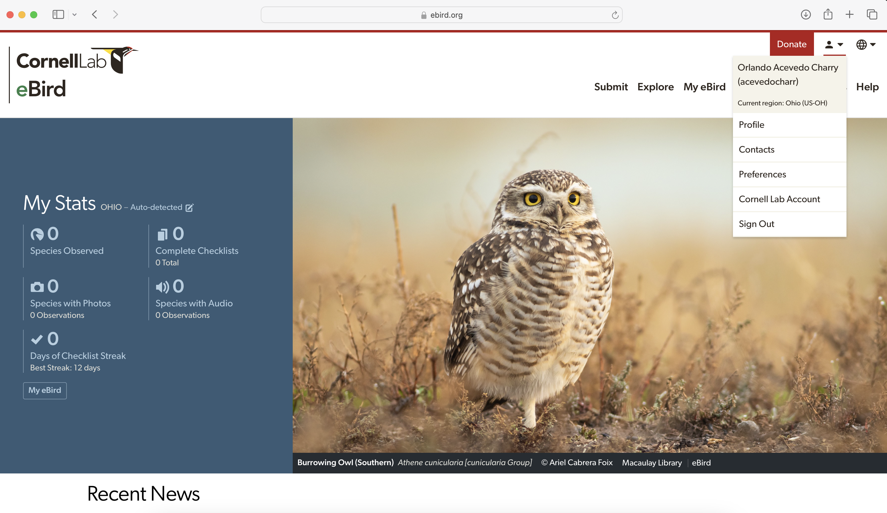
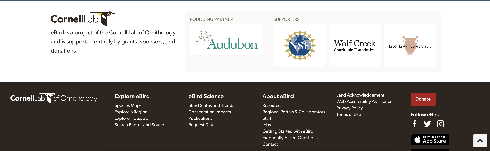

This code presents the analysis of eBird data from Mitú, Vaupés, in the easternmost Amazon region of Colombia. The aim is to use eBird data to evaluate community science contribution in a remote region of northwestern Amazonia.

Este código presenta el análisis de los datos de eBird de Mitú, Vaupés, en el borde oriental de la Amazonia colombiana. El objetivo es usar datos de eBird para evaluarl la contribución de ciencia comunitaria en una región remota de la Amazonia noroccidental.

## Packages needed - Paquetes necesarios

You will need to have some packages installed to access the data and manipulate it.

Necesitara tener algunos paquetes instalados para accesar los datos y manipularlos.

```{r}
#eBird data filters - filtro a los datos de eBird
library(auk); 
#seven packages in one for data management and visualization - siete paquetes en uno para manipulación y visualización de datos
library(tidyverse);
#Spatiotemporal Subsampling - submuestreo espaciotemporal
library(dggridR); 
#load maps - cargar mapas
library(maps); 
#composite figure - figuras compuestas
library(gridExtra); 
#Sankey plot with ggplot
library(ggsankey) #should be installed via `devtools::install_github("davidsjoberg/ggsankey")`
```

## 1. eBird data download - descarga de datos de eBird

We download the eBird data in [eBird - Data Access](https://ebird.org/data/download) - you should be logged in.

Descargamos los datos de eBird en [eBird - Acceso a los datos](https://ebird.org/data/download) - debe ingresar con su cuenta.



Then, go to the bottom of the page, and click on "Request data"

Vaya hasta la parte de abajo de la página y haga click en "Pedir datos"



Click on "Basic dataset (EBD)"

Seleccione el "Conjunto de datos básico (EBD)"


And add the region, in our case `Vaupés, Colombia (CO)`

Y escriba la región, en nuestro caso `Vaupés, Colombia (CO)`


When the download is ready, an email to your account will provide a link to download the files. Move this folder to your working directory.

Cuando la descarga esté lista, un correo electrónico a su cuenta le va a proveer un hipervínculo para descargar los archivos. Mueva esta carpeta a su directorio de trabajo.


This folder has many files, the two files of our interest are `ebd_CO-VAU_smp_relMay-2024_sampling.txt` (sampling event data) and `ebd_CO-VAU_smp_relMay-2024.txt` (event data).

Esta carpeta tiene varios archivos, de nuestro interés son los dos archivos `ebd_CO-VAU_smp_relMay-2024_sampling.txt` (datos de evento de muestreo) and `ebd_CO-VAU_smp_relMay-2024.txt` (datos de evento).

## 2. eBird data exploration - explorando los datos de eBird

The downloaded data include all the Vaupes department, we can see the entire department and use filters to compare this data.

Los datos descargados incluyen todo el Vaupés, posemos ver el departamento entero y usar filtros para compara los datos.

```{r}
f_ebd <- "temporal/ebd_Mitu.txt"                         #Data to be saved
f_sed <- "temporal/sed_Mitu.txt"                         #Sampling event to be saved

#select the columns to extract (based on x$col_idx$name)
colsE <- c("observer_id", "sampling_event_identifier",
           "group identifier",
           "common_name", "scientific_name",
           "observation_count",
           "state_code", "locality_id", "latitude", "longitude",
           "protocol_type", "all_species_reported",
           "observation_date",
           "time_observations_started",
           "duration_minutes", "effort_distance_km",
           "number_observers")

ebd_filt<-auk_ebd("ebd_CO-VAU_smp_relMay-2024/ebd_CO-VAU_smp_relMay-2024.txt",
                  file_sampling = "ebd_CO-VAU_smp_relMay-2024/ebd_CO-VAU_smp_relMay-2024_sampling.txt") %>%
#  auk_bbox(c(-70.378, 0.835,-69.851, 1.325)) %>% #W, S, E, N
  auk_filter(f_ebd, f_sed, overwrite=T, keep = colsE)

#and with read_ebd I apply another filter to do not repeate records from groups
sed_only <- read_sampling(f_sed)
ebd_only <- read_ebd(f_ebd)
```

This dataset include "complete" and "incomplete" lists. Our first exploration could be regarding this categorical variable

Este conjunto de datos incluye listas "completas" e "incompletas". Nuestra primera exploración puede ser con base a esta variable categórica

```{r}
ebd_only %>%
  group_by(all_species_reported) %>%
  summarise(n_records = n())
```

Another exploration is the geographic extend of sampling effort (we can use `sed_only`). A simple map will be help to see where in the department eBird has been used.

Otra exploración es la extensión geográfica del esfuerzo de muestreo (podemos usar `sed_only`). Un simple mapa nos ayudará a ver donde eBird se ha usado en el departamento.

```{r}
#A global map to make figures ###
world1 <- sf::st_as_sf(maps::map(database = 'world', plot = FALSE, fill = TRUE))

ggplot()+
  geom_sf(data = world1)+
  coord_sf(xlim = c(-71.477, -69.353), 
           ylim =  c(-1.10711, 1.35211)) +
  geom_point(data = sed_only, 
             aes(x = longitude, y = latitude), 
             size = 0.5, 
             alpha = 0.25)+
  labs(title = "eBird Sampling effort in Vaupés, Colombia")+
  theme_bw()

```

We can explore the data filtered to our study site, and assess different aspects, such as the number of checklists per protocol, spatiotemporal sampling effort.

Podemos explorar los datos filtrados en nuestro sitio de estudio y evaluar diferentes aspectos, como el numero de listas por protocolo o esfuerzo espacio temporal.

### 2.1 Protocol type - tipo de protocolo

```{r}
#Explore some sampling effort information - Protocol type

print(table(ebd_only$protocol_type)) #to see the names and overall count

ebd_only %>%
  group_by(sampling_event_identifier, protocol_type) %>% 
  summarise() %>% 
  ggplot(aes(x = factor(protocol_type, 
                        levels = c("Traveling",
                                   "Stationary",
                                   "Incidental",
                                   "Historical",
                                   "Banding","Area"))))+
    geom_bar(stat = "count")+
    stat_count(geom = "text", colour = "white", size = 3.5,
               aes(label = after_stat(count)), position=position_stack(vjust=0.5))+
  labs(title = "Protocol - Protocolo",
       x = "",
       y = "# Checklists - listas")+
  theme_classic()+
  theme(axis.text.x = element_text(angle = 65, hjust = 1, vjust = 1))

#which checklist includes "Banding" or "Area" protocols?

ebd_only |>
  filter(protocol_type %in% c("Banding", "Area")) |>
  select(sampling_event_identifier) |>
  unique()

```

We can see that two checklists include "Banding" or "Area" protocols. "Banding" records came from the checklists [S36819056](https://ebird.org/checklist/S36819056). This list occurred during mist netting activity (Agripino González with the Sinchi Institute), but for sure the list do not report only the captured birds for banding (best recommendation). When working with mist nets, we should submit two separated lists: one with all the birds heard or seen (but not captured) under "Traveling" or "Stationary", and one ONLY with the captured birds. On the other hand, records by "Area" checklist came from [S55879500](https://ebird.org/checklist/S55879500), by a "group" account submission. Group accounts should not report the list primarily, because we do not have a person to contact. This protocol is very exhaustive for rigorous surveys, thus it might be a "Traveling" list.


Podemos ver que hay dos listas que incluyen "Anillamiento" o "Busqueda intensa por área". Los registros de la lista de "Anillamiento" son de [S36819056](https://ebird.org/checklist/S36819056). Esta lista ocurrió durante actividad de redes de niebla (Agripino González con el Instituto Sinchi),pero la lista seguramente no está reportando solo las aves caputradas para anillar (mejor recomendación).Cuando se trabaje con redes de niebla, uno deberia someter dos listas separadas: una para las aves vistas y escuchadas (pero no capturadas) siguiendo protocolos de "desplazamiento" o "estacionario", y otra SOLO con las aves capturadas. Por otro lado, los registros de la lista de "Busqueda intensa por área" vienen de [S55879500](https://ebird.org/checklist/S55879500), sometida por una cuenta grupal. Las cuentas grupales no deben reportar las listas, pues no tenemos una persona real de contacto. Este protocolo es muy exahustivo para muestreos rigurosos y repetitivos, entonces tal vez debería responder mas a "desplazamiento".


We will focus in "best practices" records from "Traveling" and "Stationary" protocols. We can also explore the effort (duration, distance, observers, hour of sampling).

First, we have to do some adjustment to the data:


Vamos a enfocarnos en los registros con "mejores prácticas" dentro de los protocolos "desplazamiento" y "estacionario". Podemos tambien explorar el esfuerzo (duracion, distancia, # observadores, horas de muestreo).

Primero debemos hacer algunos ajustes a los datos:

```{r}
# Function to convert time observation to hours since midnight
time_to_decimal <- function(x) {
  x <- hms(x, quiet = TRUE)
  hour(x) + minute(x) / 60 + second(x) / 3600
}

# clean up variables
ebd_count <- ebd_only %>%
  mutate(
    # We don't have here count in X to convert to NA
    observation_count = as.integer(observation_count),
    # effort_distance_km to 0 for non-travelling counts
    effort_distance_km = if_else(protocol_type == "Stationary",
                                 0, effort_distance_km),
    #effort_distance_km change to integer no decimals
    effort_distance_kmI = round(effort_distance_km, digits = 0),
    # convert time to decimal hours since midnight
    time_observations_started = time_to_decimal(time_observations_started),
    # split date into year, month, week, and day of year
    year = year(observation_date),
    month = month(observation_date),
    week = week(observation_date),
    day_of_year = yday(observation_date))

ebd_count <- ebd_count |>
  group_by(sampling_event_identifier) |>
  summarise(Total_ind = sum(observation_count, na.rm = T)) |>
  left_join(ebd_count)

```

With this, we can assign each observation to different groups.

Con esto, podemos asignar cada observación a diferentes grupos.

## 3. Assigning each record to detail of sampling - asignando cada registro en referencia al detalle de muestreo

Podemos plantear diferentes niveles de resolución de esfuerzo, el primer paso para saber cómo analizar estos datos:

1. "Ultrafine": una resolución super fina incluye solo listas compeltas, estacionarias, por un solo observador, entre 20-30 minutos, reportando al menos 15 individuos, e incluyendo estimación de abundancia para cada especie. A esta o la siguiente (Fine) deberíamos apuntar a llegar!

```{r}
Ultrafine <- ebd_count |>
  filter(all_species_reported == "TRUE",
         protocol_type == "Stationary",
         number_observers == 1,
         duration_minutes %in% c(20:30),
         Total_ind >= 15) |>
  drop_na(observation_count) |>
  mutate(Grupo = "Ultrafine")
```

2. "Fine": resolución fina (interesante para encontrar bosques de arenas blancas). Solo listas completas, de "traveling" o "stationary" con un esfuerzo ≥1 km o entre 5 minutos a 1 hora, hasta 10 observadores, e incluyendo estimación de abundancia para cada especie.

```{r}
Fine <- ebd_count |>
  filter(all_species_reported == "TRUE",
         protocol_type %in% c("Stationary", "Traveling"),
         duration_minutes %in% c(5:60),
         effort_distance_kmI %in% c(0:1),
         number_observers %in% c(1:10)) |>
  drop_na(observation_count)|>
  mutate(Grupo = "Fine")
```

3. "Coarse": resolución gruesa, pero es la estandarizada que se usa a nivel mundial en escalas macroecológicas. Incluye listas completas de "traveling" o "stationary" con un esfuerzo ≥5 km o entre 5 minutos a 5 horas (300 minutos) de muestreo, hasta 10 observadores, y que incluyan estimación de abundancia de las especies reportadas.

```{r}
Coarse <- ebd_count |>
  filter(all_species_reported == "TRUE",
         protocol_type %in% c("Stationary", "Traveling"),
         duration_minutes %in% c(5:300),
         effort_distance_kmI %in% c(0:5), 
         number_observers %in% c(1:10)) |>
  drop_na(observation_count) |>
  mutate(Grupo = "Coarse")
```

4. "Room for improvement": incluir listas completas de cualquier otro protocolo, por mas de 5 horas o por mas de 5 km, e incluyendo mas de 10 observadores.

```{r}
ToImprove <- ebd_count |>
  filter(all_species_reported == "TRUE",
         protocol_type %in% c("Area",
                              "Banding",
                              "Historical",
                              "Incidental") |
         duration_minutes %in% c(1:4,300:1440) | 
         effort_distance_kmI > 5 |
         number_observers > 10 |
         is.na(observation_count)) |>
  mutate(Grupo = "ToImprove")
```

5. "Incomplete" son las listas correctamente identificadas como incompletas, las cuales al momento de analizar, por lo general, se filtran, pues no hay certeza de algunos aspectos del muestreo.

```{r}
Incomplete <- ebd_count |>
  filter(all_species_reported == "FALSE") |>
  mutate(Grupo = "Incomplete")
```

Combinar ahora los grupos

```{r}
Grupos <- rbind(Ultrafine, Fine, Coarse, ToImprove, Incomplete)

ebd_eff <- ebd_count |>
  left_join(Grupos) #some checklists classify in different groups

table(ebd_eff$Grupo)

nrow(ebd_eff)-sum(41276,6941,8800,72677,102)

```

## 4. Distribution of the records - distribución de los registros

Hacer un "Sankey plot", como el flujo de numero de registros entre los diferentes niveles de filtrar los datos, resultando a las cinco categorías utilizadas.

```{r}
ebd_eff <- ebd_eff |>
  mutate(All = "eBird Vaupés (CO) - 122,796",
         Lists = case_when(all_species_reported == FALSE ~ "b. Incomplete - 6.8%",
                              all_species_reported == TRUE ~"a. Complete - 93.2%"),
         Protocol = case_when(protocol_type == "Area" ~ "e. Area and Banding - <1%",
                              protocol_type == "Banding" ~ "e. Area and Banding - <1%",
                              protocol_type == "Historical" ~ "b. Historical - 6.4%",
                              protocol_type == "Incidental" ~ "d. Incidental - 3.9%",
                              protocol_type == "Stationary" ~ "c. Stationary - 4.8%",
                              protocol_type == "Traveling" ~ "a. Traveling - 84.8%"),
         Duration = case_when(duration_minutes %in% c(1:5) ~ "a. 1-5 minutes - <1%",
                              duration_minutes %in% c(5:20) ~ "b. 5-20 minutes - 3.3%",
                              duration_minutes %in% c(20:30) ~ "c. 20-30 minutes - 2.3%",
                              duration_minutes %in% c(30:60) ~ "d. 0.5-1 hour - 6.6%",
                              duration_minutes %in% c(60:300) ~ "e. 1-5 hours - 37.0%",
                              duration_minutes > 300 ~ "f. >5 hours - 41.5%",
                              is.na(duration_minutes) ~ "NA - 8.5"),
         Distance = case_when(effort_distance_kmI %in% c(0:1) ~ "a. < 1 km - 18.8%",
                              effort_distance_kmI %in% c(1:2) ~ "b. 1-2 km - 11.1%",
                              effort_distance_kmI %in% c(2:5) ~ "c. 2-5 km - 28.1%",
                              effort_distance_kmI > 5 ~ "d. >5 km - 32.3%",
                              is.na(effort_distance_kmI) ~ "NA - 9.6%"),
         Observers = case_when(number_observers %in% c(1) ~ "a. 1 eBirder - 12.6%",
                               number_observers %in% c(2:5) ~ "b. 2-5 eBirders - 55.4%",
                               number_observers %in% c(5:10) ~ "c. 5-10 eBirders - 22.1%",
                              number_observers %in% c(10:20) ~ "d. 10-20 eBirders - 5.6%",
                              number_observers >20 ~ "e. >20 eBirders - <1%",
                              is.na(number_observers) ~ "NA - 4.3%"),
         Category = case_when(Grupo == "Ultrafine" ~ "a. Ultrafine - <1%",
                              Grupo == "Fine" ~ "b. Fine - 5.3%",
                              Grupo == "Coarse" ~ "c. Coarse - 31.8%",
                              Grupo == "ToImprove" ~ "d. Room for improvement - 56.0%",
                              Grupo == "Incomplete" ~ "e. Correctly removed - 6.7%",
                              is.na(Grupo) ~ "Not Aplicable"))

dfVA_CO <- ebd_eff |>
  make_long(All, Lists, Protocol, Duration, Distance, Observers, Category)

ggplot(dfVA_CO, aes(x = x, next_x = next_x, node = node, next_node = next_node, fill = factor(node), label = node)) +
  geom_sankey(flow.alpha = .6,
              node.color = "gray30") +
  geom_sankey_label(size = 2.5, color = "white", fill = "gray40") +
  scale_fill_viridis_d(drop = FALSE) +
  theme_sankey(base_size = 18) +
  labs(x = NULL) +
  theme(legend.position = "none",
        plot.title = element_text(hjust = .5)) +
  ggtitle("Vaupés - eBird data")

```

Aquí se ve que la mayor cantidad de datos de eBird desde Vaupés pueden mejorar (55.88%). Si se usa una resolución gruesa de muestreo, solo ~32% de los datos es utilizable. Para preguntas que requieren detallada información espacio temporal hay muy pocos registros (resolución fina 5%, resolución ultra fina <1%). 

Otra opción es hacero "alluvial"

```{r}
ggplot(dfVA_CO, aes(x = x, next_x = next_x, node = node, next_node = next_node, fill = factor(node), label = node)) +
  geom_alluvial(flow.alpha = .6,
              node.color = "gray30") +
  geom_alluvial_label(size = 2, color = "white", fill = "gray40") +
  scale_fill_viridis_d(drop = FALSE) +
  theme_alluvial(base_size = 18) +
  labs(x = NULL) +
  theme(legend.position = "none",
        plot.title = element_text(hjust = .5),
        axis.text.y = element_blank(),
        axis.ticks.y = element_blank()) +
  ggtitle("Vaupés - eBird data")
```
